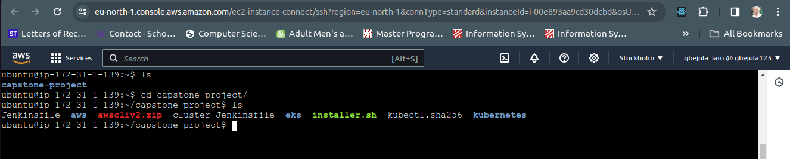
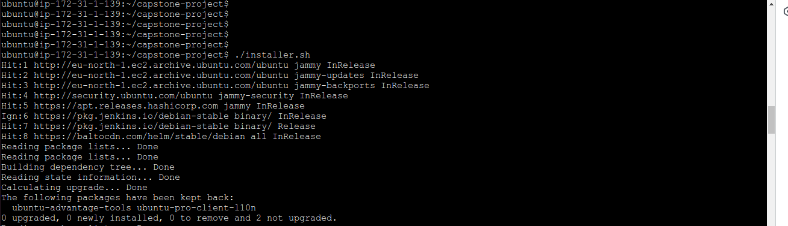

# SOCKS SHOP MICROSERVICES APPLICATION README.

## Project Overview

### Objective

Deploy the Socks Shop microservices-based application using Infrastructure as Code (Iac) on Kubernetes, emphasizing efficiency, automation and security.

### Resources provided

- Socks Shop Microservices Demo: [GitHub Repo](https://github.com/microservices-demo/microservices-demo.github.io)

## Deployment Instructions

### Deploy using Infrastructure as Code

This process must be automated using a reliable and rapid deployment on Kubernetes. This can be achieved with Ansible or Terraform for managed configurations. However, for this project, Terraform is used for configuration management.

### Evaluation

This project should emphasize readability, maintainability and easy comprehension. 

### Criteria and checklist

#### Deployment Pipeline 

Design a continuous integration and continuous deployment pipeline that moves the code from GitHub to Kubernetes.

#### Logging

Implement metrics to ensure that logging and tracking of application's functionality. 

#### Monitoring

Use prometheus for monitoring.

#### Metrics

Configure Alert manager for alerts and Grafana can be used for visualization.

## Extra Project Requirement
- **Https Requirement**
  - The application should run on HTTPS with a Let's Encrypt certificate

- **Infrastructure Security**
  - Secure the infrastructure with network perimeter security access rules

- **Sensitive Information**
  - Use Ansible Vault for encrypting sensitive informatin.

## IMPLEMENTATION STEPS FOR DEPLOYMENT.

Create an Ubuntu instance on AWS for infrastructure deployment. Copy the code from the cloned repository to the Ubuntu server to run the deployment application. 

> Clone repo to Ubuntu instance

`git clone https://github.com/gbejula/capstone-project`

> Connect to the AWS Ubuntu instance and change directory into the code. Deploy the _installer.sh_ to update the server and install applications listed below:





> **Update the Update server**

```
sudo apt-get update -y
sudo apt-get upgrade -y
```

> **Install unzip**

This is used for extracting the zip archives.

```
sudo apt-get install unzip
```

> **Install Terraform**

