# SOCKS SHOP MICROSERVICES APPLICATION README.

## Project Overview

### Architectural Diagram

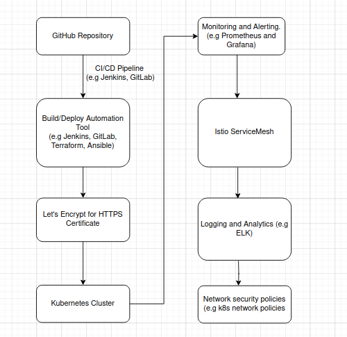

**GitHub Repository**

This is used to store the source code by the developers

**CI/CD Pipeline**

Continuous integration and continuous deployment pipeline used for the build automation, test and deployment. 

**Build/Deploy Automation**

This is used to deploy images generated to the Kubernetes cluster. 

**Kubernetes Cluster**

The microservice are deployed in the cluster. This manages the containerized applications and services.

**Monitoring and Alerting**

This is used for monitoring and alerts. It helps to keep track of the health and performance of the services. Grafana show a graphical representation for faster views.

**Istio Service Mesh**

This is used for service discovery, load balancing, observability and security of the microservices.

**Logging and Analytics**

This is used for debugging and logs analyzing and performance checks.


### Objective

Deploy the Socks Shop microservices-based application using Infrastructure as Code (Iac) on Kubernetes, emphasizing efficiency, automation and security.

### Resources provided

- Socks Shop Microservices Demo: [GitHub Repo](https://github.com/microservices-demo/microservices-demo.github.io)

## Deployment Instructions

### Deploy using Infrastructure as Code

This process must be automated using a reliable and rapid deployment on Kubernetes. This can be achieved with Ansible or Terraform for managed configurations. However, for this project, Terraform is used for configuration management.

### Evaluation

This project should emphasize readability, maintainability and easy comprehension. 

### Criteria and checklist

#### Deployment Pipeline 

Design a continuous integration and continuous deployment pipeline that moves the code from GitHub to Kubernetes.

#### Logging

Implement metrics to ensure that logging and tracking of application's functionality. 

#### Monitoring

Use prometheus for monitoring.

#### Metrics

Configure Alert manager for alerts and Grafana can be used for visualization.

## Extra Project Requirement
- **Https Requirement**
  - The application should run on HTTPS with a Let's Encrypt certificate

- **Infrastructure Security**
  - Secure the infrastructure with network perimeter security access rules

- **Sensitive Information**
  - Use Ansible Vault for encrypting sensitive informatin.

## Implementation Steps for Deployment.

### Phase I

Create an Ubuntu instance on AWS for infrastructure deployment. Copy the code from the cloned repository to the Ubuntu server to run the deployment application. 

> Clone repo to Ubuntu instance

`git clone https://github.com/gbejula/capstone-project`

> Connect to the AWS Ubuntu instance and change directory into the code. Deploy the _installer.sh_ to update the server and install applications listed below:


> **Update the Update server**

```
sudo apt-get update -y
sudo apt-get upgrade -y
```

> **Install unzip**

This is used for extracting the zip archives.

```
sudo apt-get install unzip
```

> **Install Terraform**
  - Add HashiCorp repository's GPG key to verify the Terraform package.
  - Add the HashiCorp repository to `/etc/apt/sources.list.d/hashicorp.list`
  - updates the package lists and installs Terraform using `apt-get`

> **Install kubectl**
  - Kubernetes and all its dependencies are installed. 
  
> **Install AWS CLI**
  - AWS CLI and all its dependencies are installed.

> **Install Helm**
  - Helm and all its dependencies are installed.

> **Install Jenkins**
  - Jenkins and all its dependencies are installed.

### Phase II

Install Jenkins on the Ubuntu server.

- Install JDK

```
sudo apt update
sudo apt install default-jdk-headless
```

- Install Jenkins

```
wget -q -O - https://pkg.jenkins.io/debian-stable/jenkins.io.key | sudo apt-key add -
sudo sh -c 'echo deb http://pkg.jenkins.io/debian-stable binary/ > /etc/apt/sources.list.d/jenkins.list'
sudo apt update
sudo apt-get install jenkins
```

- Verify Jenkins is up and running

```
sudo systemctl status jenkins
```

- Perform initial Jenkins setup from the browser by accessing 
    - Note: open port 8080 by creating a TCP inbound rule in the security group

  ```
  http://jenkins-server-public-ip-address:8080
  ```

  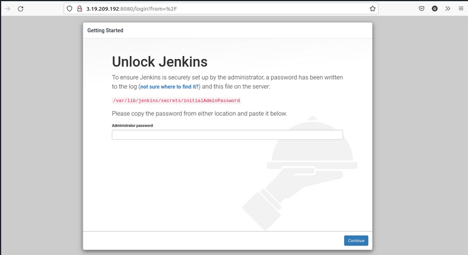

  - Retrieve the administrator password from the server using:

  ```
  sudo cat /var/lib/jenkins/secrets/initialAdminPassword
  ```

  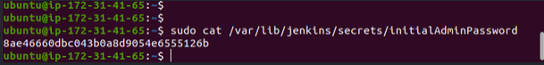

  - Enter the password in the admin page and click continue

  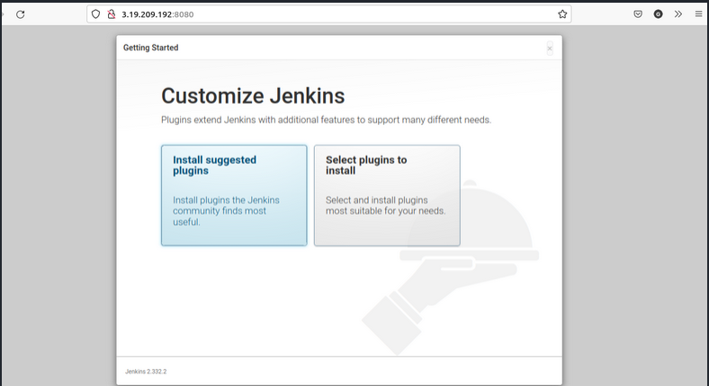

  - Click install suggested plugins

  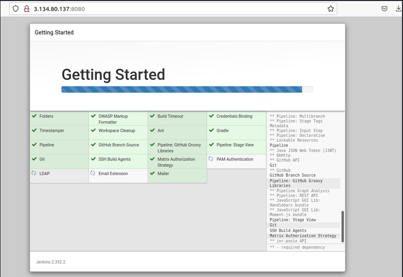

  - Create admin account after plugins installation is complete

  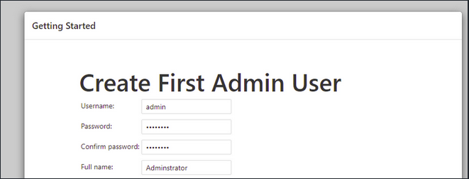

  - Jenkins is fully ready for deployment and use

  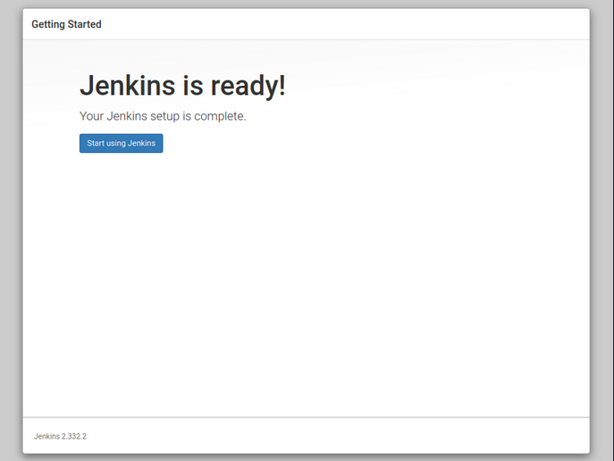

  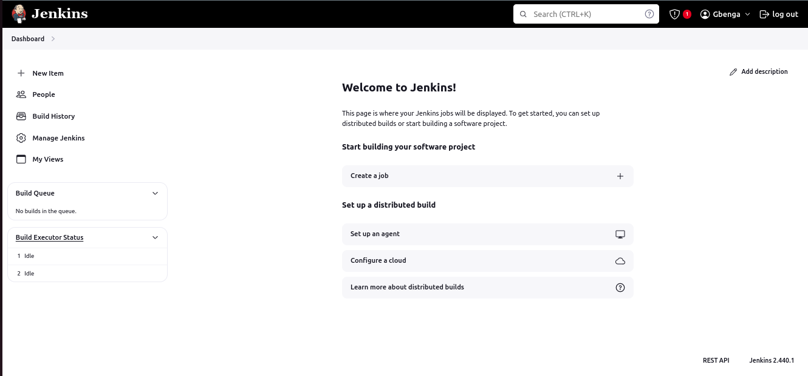

- Upon completion of installation, access the Jenkins dashboard by signing in with the credentials registered during installation. Jenkins is now accessible on the browser using the public ip address of the server created on AWS instance with port _8080_.

### Phase III

- Create a Jenkins pipeline for the GitHub repository and Jenkinsfile

- Setup Jenkins credential
  - Set up the username and password for the pipeline to be able to connect and pull to the repository.

- Create a Jenkins Job
  - Create a new job and provide a new for the job
  - Select Pipeline as the job type
  - Then click "ok" to create the job

* Configure the Pipeline
  * Scroll to the pipeline section for configuration
  * Choose source code management (SCM) to retrieve the code for GitHub or any other version code system.
  * Select Git from the "Pipeline script from SCM" as Git is the SCM.
  * Enter the GitHub repository URL `https://github.com/gbejula/capstone-project`. Select the credential and the branch for the build.

- Write the Jenkinsfile
  - The Jenkinsfile defines the pipeline stages, steps and other configurations.
  - Commit the Jenkinsfile to the repository so that it can be initiated when the pipeline starts.

- Save and Run the job
  - The build can be triggered manually. However, for the build to be triggered automatically, there must should be a code change and commit to the repository.

  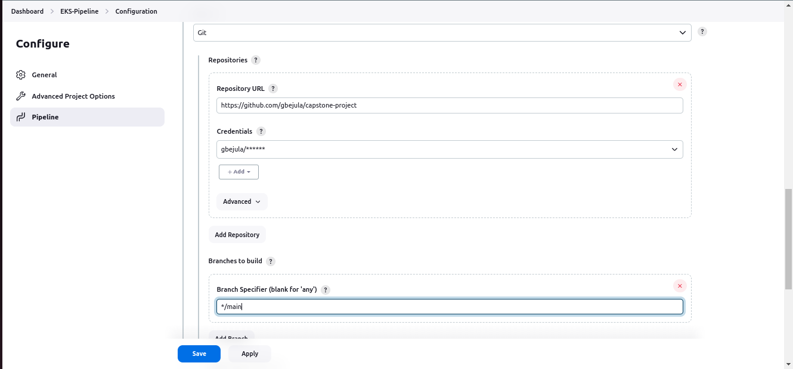

- Monitoring
  - The progress of the build can be monitored on the dashboard. More information can be found in view console output and logs.

  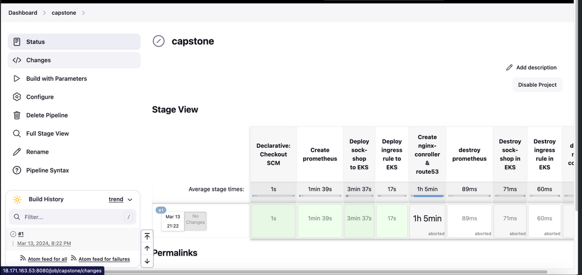

  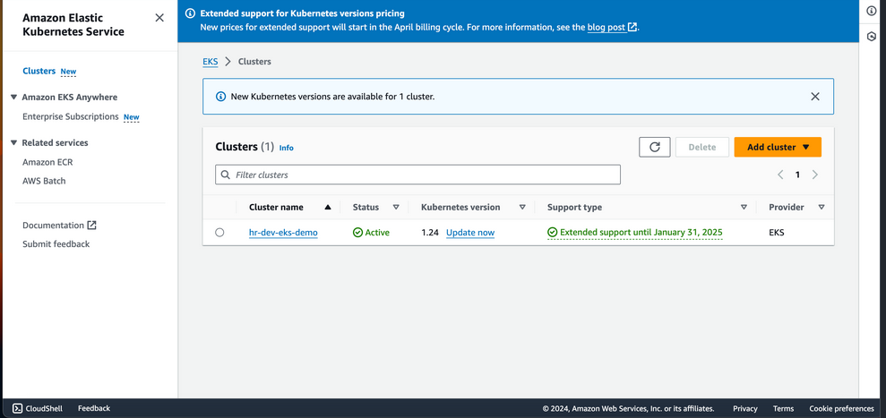


### Phase IV

- After the Jenkins pipeline is completed, check the Ubuntu server to ensure that the Kubernetes has been deployed in the correct namespace.

  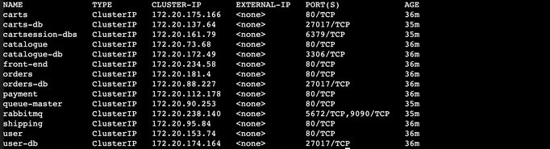

  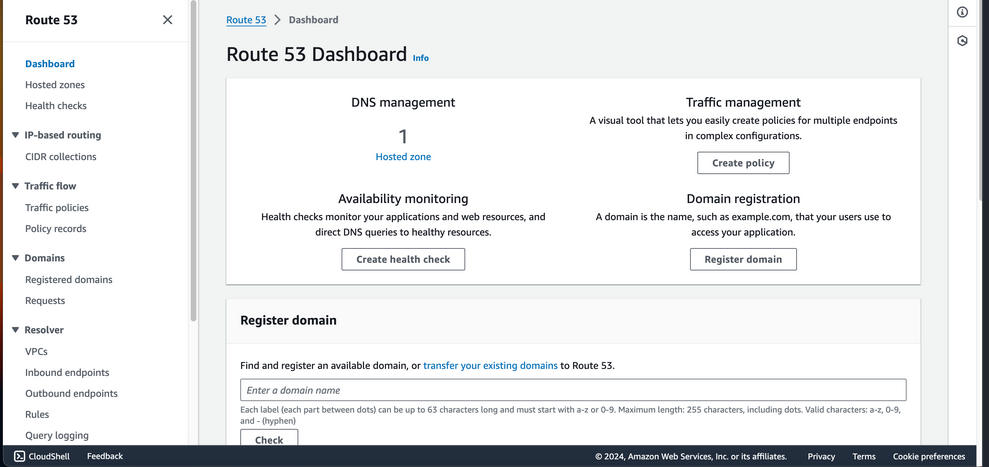

  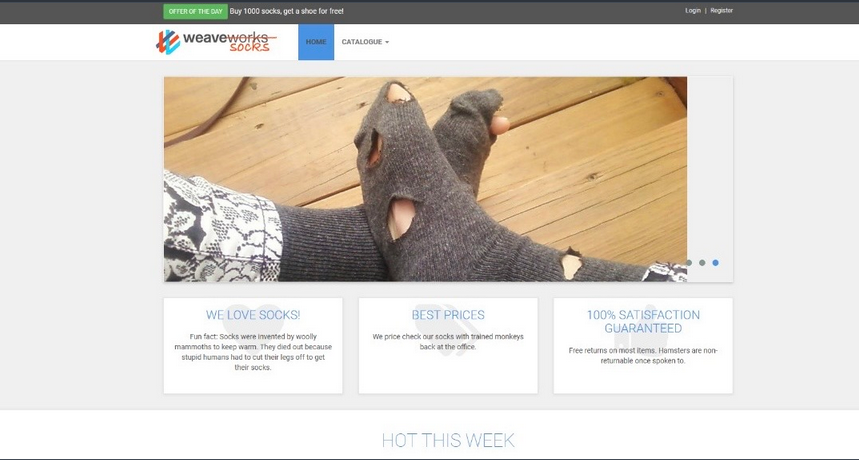