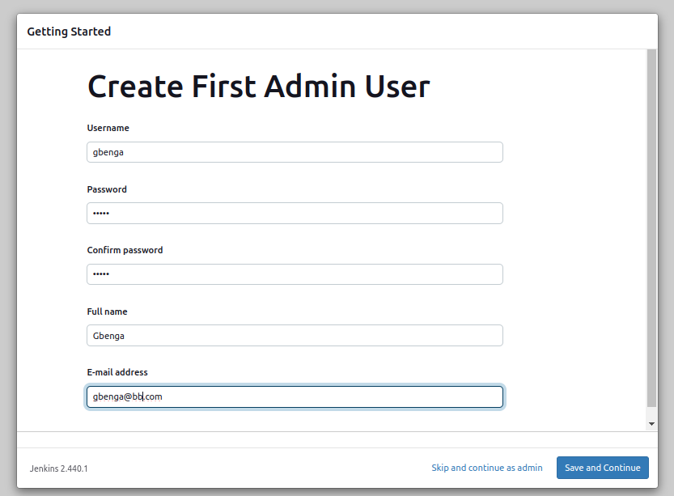

# SOCKS SHOP MICROSERVICES APPLICATION README.

## Project Overview

### Objective

Deploy the Socks Shop microservices-based application using Infrastructure as Code (Iac) on Kubernetes, emphasizing efficiency, automation and security.

### Resources provided

- Socks Shop Microservices Demo: [GitHub Repo](https://github.com/microservices-demo/microservices-demo.github.io)

## Deployment Instructions

### Deploy using Infrastructure as Code

This process must be automated using a reliable and rapid deployment on Kubernetes. This can be achieved with Ansible or Terraform for managed configurations. However, for this project, Terraform is used for configuration management.

### Evaluation

This project should emphasize readability, maintainability and easy comprehension. 

### Criteria and checklist

#### Deployment Pipeline 

Design a continuous integration and continuous deployment pipeline that moves the code from GitHub to Kubernetes.

#### Logging

Implement metrics to ensure that logging and tracking of application's functionality. 

#### Monitoring

Use prometheus for monitoring.

#### Metrics

Configure Alert manager for alerts and Grafana can be used for visualization.

## Extra Project Requirement
- **Https Requirement**
  - The application should run on HTTPS with a Let's Encrypt certificate

- **Infrastructure Security**
  - Secure the infrastructure with network perimeter security access rules

- **Sensitive Information**
  - Use Ansible Vault for encrypting sensitive informatin.

## IMPLEMENTATION STEPS FOR DEPLOYMENT.

### Step 1

Create an Ubuntu instance on AWS for infrastructure deployment. Copy the code from the cloned repository to the Ubuntu server to run the deployment application. 

> Clone repo to Ubuntu instance

`git clone https://github.com/gbejula/capstone-project`

> Connect to the AWS Ubuntu instance and change directory into the code. Deploy the _installer.sh_ to update the server and install applications listed below:


> **Update the Update server**

```
sudo apt-get update -y
sudo apt-get upgrade -y
```

> **Install unzip**

This is used for extracting the zip archives.

```
sudo apt-get install unzip
```

> **Install Terraform**
  - Add HashiCorp repository's GPG key to verify the Terraform package.
  - Add the HashiCorp repository to `/etc/apt/sources.list.d/hashicorp.list`
  - updates the package lists and installs Terraform using `apt-get`

> **Install kubectl**

> **Install AWS CLI**

> **Install Helm**

> **Install Jenkins**

### Step 2

Install Jenkins on the Ubuntu server.

- Install JDK

```
sudo apt update
sudo apt install default-jdk-headless
```

- Install Jenkins

```
wget -q -O - https://pkg.jenkins.io/debian-stable/jenkins.io.key | sudo apt-key add -
sudo sh -c 'echo deb http://pkg.jenkins.io/debian-stable binary/ > /etc/apt/sources.list.d/jenkins.list'
sudo apt update
sudo apt-get install jenkins
```

- Verify Jenkins is up and running

```
sudo systemctl status jenkins
```

- Perform initial Jenkins setup from the browser by accessing 
    - Note: open port 8080 by creating a TCP inbound rule in the security group

  ```
  http://jenkins-server-public-ip-address:8080
  ```

  

  - Retrieve the administrator password from the server using:

  ```
  sudo cat /var/lib/jenkins/secrets/initialAdminPassword
  ```

  

  - Enter the password in the admin page and click continue

  

  - Click install suggested plugins

  

  - Create admin account after plugins installation is complete

  

  - Jenkins is fully ready for deployment and use

  

- Upon completion of installation, access the Jenkins dashboard by signing in with the credentials registered during installation. Jenkins is now accessible on the browser using the public ip address of the server created on AWS instance with port _8080_.